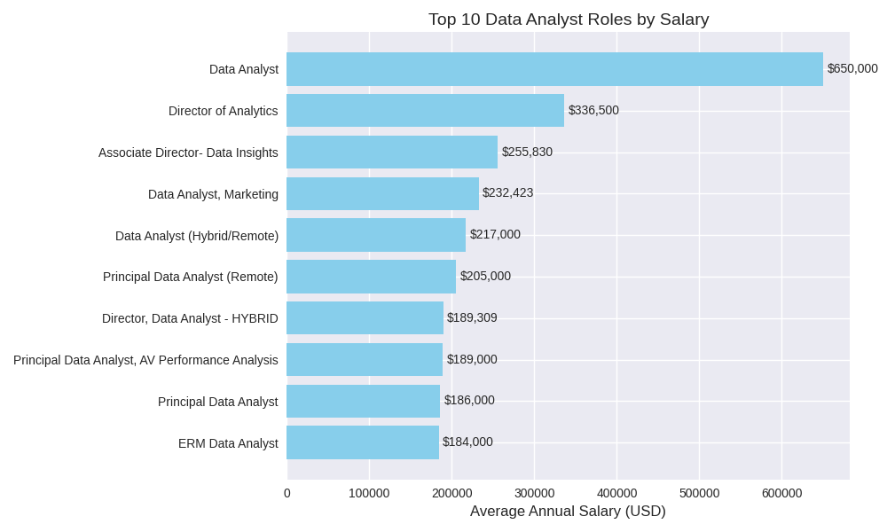
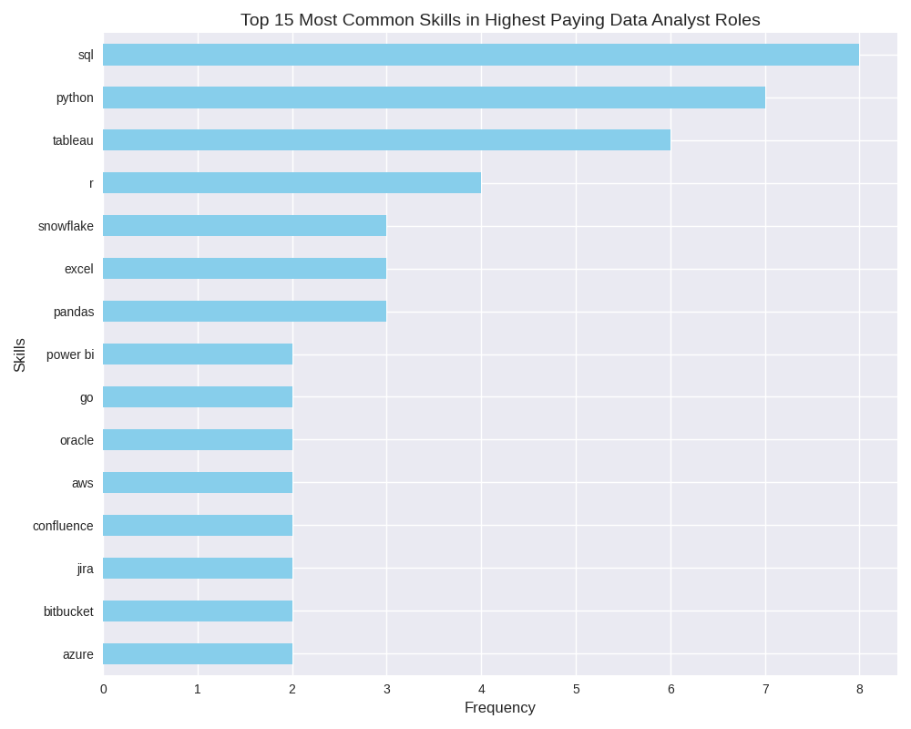
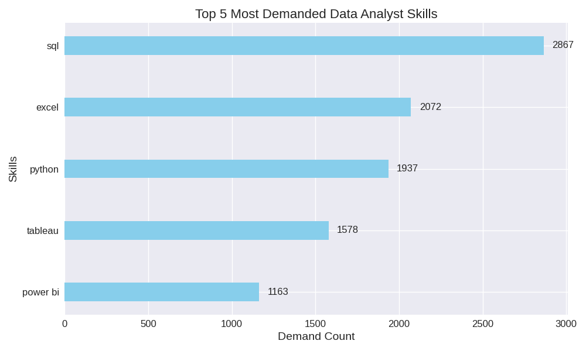
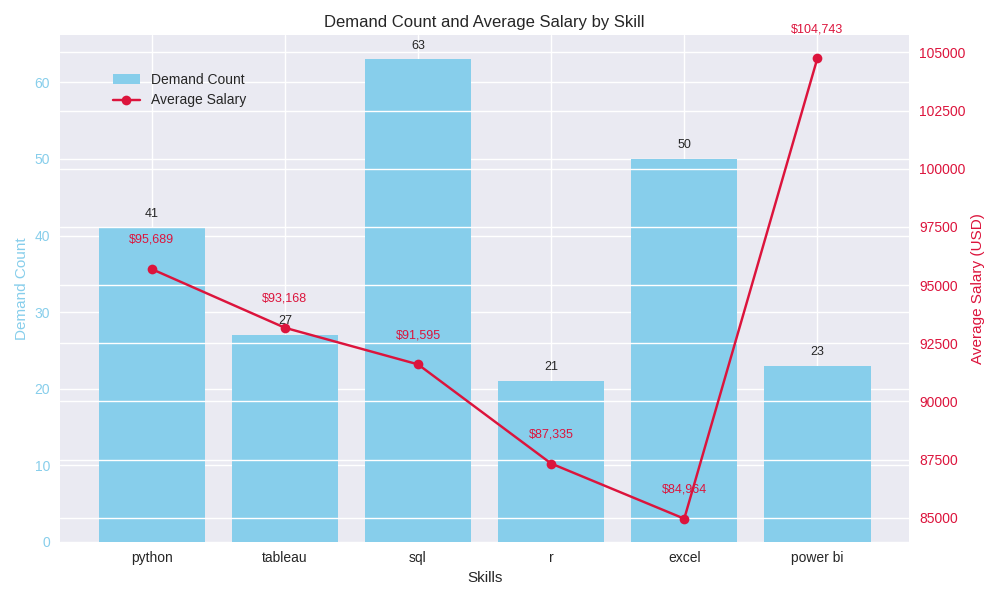

<h1 align="center"> Data Jobs Analysis using SQL </h1>
<p align="center"> <em>Exploring the data job market to uncover top-paying jobs and most in-demand skills using SQL.</em> <p>

---

## Introduction

The **Data Jobs Analysis using SQL** project explores job market data to uncover insights about:
- Which **skills** command the **highest salaries**
- Which **skills** are **most in demand**
- And which ones offer the **best balance between pay and demand**

The goal is to help aspiring data professionals understand which skills bring the best career opportunites.

<em>You will find the SQL queries in the README file but if you want to download them, click here : </em> [project_sql](/project_sql/)

## Background

With the rapid growth of data-driven industries, the demand for data professionals has increased signficantly. However, the job market is diverse - different roles require different skill sets, and salaries vary widely across positions.

This project was created to explore these differences using real-world job data. By analyzing job postings through SQL, it aims to highlight which skills are not only in high demand but also offer the best financial rewards.

## Tools Used 


- **SQL** – for querying and analyzing data  
- **PostgreSQL** – as the main database for executing SQL queries  
- **Excel / CSV** – for initial data cleaning and formatting  
- **Git** – for version control and tracking project changes  
- **GitHub** – for hosting and sharing the project repository  
- **Visual Studio Code (VS Code)** – as the main code editor

## The Analysis

The analysis was performed using SQL to extract key insights from the dataset. Each query was designed to answer a specific question about the data job market. The questions which I wanted to find answers to :

- What are the top-paying jobs for my role?
- What are the skills required for these top-paying roles?
- What are the most in-demand skills for my role?
- What are the top skills based on salary for my role?
- Whata re the most optimal skills (high demand and high paying) to learn?

### 1. Top Paying Jobs

Identified the highest-paying data-related positions, filtered data analyst positions by average yearly salary and location, focusing on remote jobs. 

Following query retrieves the **top 10 highest-paying remote Data Analyst roles** with valid salary information, sorted by the average yearly salary.

<details>
   <summary> View SQL query </summary>

```sql
SELECT 
    job_id,
    job_title,
    name AS company_name,
    job_location,
    job_schedule_type,
    salary_year_avg,
    job_posted_date
FROM
    job_postings_fact
LEFT JOIN 
    company_dim
ON 
    company_dim.company_id = job_postings_fact.company_id
WHERE 
    job_title_short = 'Data Analyst' AND
    job_location = 'Anywhere' AND
    salary_year_avg IS NOT NULL
ORDER BY salary_year_avg DESC
LIMIT 10
```
</details>
<br>
Here's the breakdown of the top data analyst jobs in 2023:

- **High-paying roles are strongly associated with seniority and specialization.** Positions like Senior Data Analyst and Analytics Engineer consistently top the salary charts.
- **Remote opportunities offer competitive pay**, often matching or exceeding traditional in-office roles- reflecting the industry's flexibility for analytical work.
- **Companies with strong data infrastructures** (e.g., consulting and tech-focused firms) tend to offer the highest compensation for data analysts.
- **The salary range for top remote roles** averages between **$150K - $200K/year**, emphasizing how data analytics remains one of the most rewarding remote tech careers. 

<br>


*Bar graph visualizing the salary for the top 10 highest-paying Data Analyst roles; graph was generated using my SQL query results with the help of copilot.*

### 2. Skills for Top Paying Jobs

To understand what skills are required for the top-paying jobs,  joined the job postings with skills data, providing insights into what employers value for high-compensation roles.

<details>
  <summary> View SQL query </summary>

```sql
WITH top_paying_jobs AS(
    SELECT 
        job_postings_fact.job_id,
        job_title,
        name AS company_name,
        salary_year_avg
    FROM
        job_postings_fact
    LEFT JOIN company_dim ON company_dim.company_id = job_postings_fact.company_id
    WHERE 
        job_title_short = 'Data Analyst' AND
        job_location = 'Anywhere' AND
        salary_year_avg IS NOT NULL
    ORDER BY salary_year_avg DESC
    LIMIT 10
)

SELECT 
    top_paying_jobs.*,
    skills
FROM top_paying_jobs
INNER JOIN skills_job_dim ON skills_job_dim.job_id = top_paying_jobs.job_id
INNER JOIN skills_dim ON skills_dim.skill_id = skills_job_dim.skill_id 
ORDER BY 
    salary_year_avg DESC
```
</details>
<br>

Here's the breakdown of the most demanded skills for the top 10 highest paying data analyst jobs in 2023: 

- **SQL** is the most frequently required skill- appearing in **8** of the top listings. Reinforces its position as the foundation of data analysis and querying.
- **Python** follows closely, appearing **7** times- reflecting the growing demand for data manipulation, automation, and analytics programming.
- **Tableau** ranks third- visualization and reporting remain critical for communicating insights.
- Other important tools include:
  - **R** - statistical analysis
  - **Snowflake, Pandas, Excel** - data management and processing
  -**AWS, Azur, Databricks** - cloud and data engineering skills
  - **Power BI** - business intelligence and dashboarding tools.

In summary, a blend of **SQL, Python, and visualization tools (Tableau/PowerBI)** dominate the high-paying roles, with **cloud and data pipeline tools** increasingly appearing as desirable extras.


*Bar graph visualizing the most demanded skills for the top-paying Data Analyst roles. The graph was generated using my SQL dataset result with the help of copilot.*


### 3. Most In-Demand skills

To identify which technical or analytical skills appear most frequently in job postings (filtered the query for Data Analyst roles and set India as location). This helps uncover which skills are essential for employability and professional growth.

<details>
<summary> View SQL query </summary>

```sql
SELECT
    skills,
    COUNT(job_postings_fact.job_id) AS demand_count
FROM job_postings_fact
INNER JOIN skills_job_dim ON skills_job_dim.job_id = job_postings_fact.job_id
INNER JOIN skills_dim ON skills_dim.skill_id = skills_job_dim.skill_id 
WHERE 
    job_title_short = 'Data Analyst' 
    AND
    job_location LIKE '%India%'
GROUP BY 
    skills
ORDER BY 
    COUNT(job_postings_fact.job_id) DESC
LIMIT 5
```
</details>
<br>

Here are some quick insights from your dataset:

- **SQL** is the clear leader with 2867 mentions making it the foundational skill for data analysts.
- **Excel** remains highly relevant despite the rise of more advanced tools, thanks to its versatility.
- **Python** is essential for automation, data wrangling, and advanced analytics.
- **Tableau and Power BI** highlight the importance of data visualization in communicating insights.

These trends suggest that combining strong data querying (SQL), analysis (Python/Excel), and visualization (Tableau/Power BI) skill is key to staying competitive in the data analyst job market.


*Bar graph above visualizes the most demanded skills for Data Analyst job roles. Graph is generated using my SQL query dataset result with the help of copilot.*

### 4. Top Paying Skills

Identify the average salary associated with each skill to understand which technical skills lead to higher-paying opportunities. This analysis includes only job postings with Data Analyst roles and specified salaries, regardless of location.

<details>
<summary> View SQL query </summary>

```sql
SELECT
    skills,
    TO_CHAR(AVG(salary_year_avg), 'FM999,999.00') AS avg_salary_formatted
FROM job_postings_fact
INNER JOIN skills_job_dim ON skills_job_dim.job_id = job_postings_fact.job_id
INNER JOIN skills_dim ON skills_dim.skill_id = skills_job_dim.skill_id 
WHERE 
    job_title_short = 'Data Analyst' 
    AND
    salary_year_avg IS NOT NULL
GROUP BY 
    skills
ORDER BY 
    AVG(salary_year_avg) DESC
LIMIT 25
```
</details>
<br>

Here's the breakdown of the insights from the dataset result:

- **AI/ML skills** like TensorFlow,PyTorch, Keras, and Hugging Face offers salaries above $120K.
- **DevOps tools** (Terraform, Puppet, GitLab, Kafka) are highly valued for data infrastructure roles.
- **Programming languages** like Golang, Scala, and Solidity command strong pay, especially in niche domains.
- **Database & integration tools** (Couchbase, Cassandra, Twilio) also rank high in compensation.

### 5. Optimal Skills

Identify the most optimal skills for Data Analyst roles in India, combining both high demand and high average salary. It helps pinpoint the most valuable technical skills that maximize job opportunities and earning potential.

<details>
<summary> View SQL query </summary>

```sql
SELECT 
    sjd.skill_id,
    skills,
    COUNT(jpc.job_id) AS demand_count,
    TO_CHAR(AVG(salary_year_avg),'FM999,999') AS avg_salary 
FROM job_postings_fact AS jpc 
INNER JOIN skills_job_dim AS sjd ON jpc.job_id = sjd.job_id
INNER JOIN skills_dim AS sd ON sjd.skill_id = sd.skill_id
WHERE 
    job_title_short = 'Data Analyst'
    AND job_location LIKE '%India%'
    AND salary_year_avg IS NOT NULL
GROUP BY 
    sjd.skill_id,
    skills
HAVING COUNT(jpc.job_id) > 20
ORDER BY 
    avg_salary DESC,
    demand_count DESC
LIMIT 10
```
</details>
<br>
<b>Dataset result table:</b>

| skills   | demand_count | avg_salary |
|:----------|-------------:|-----------:|
| python    | 41           | 95,689     |
| tableau   | 27           | 93,168     |
| sql       | 63           | 91,595     |
| r         | 21           | 87,335     |
| excel     | 50           | 84,964     |
| power bi  | 23           | 104,743    |

<br>
Here's the breakdown of the insights from the dataset result :

- **Power BI, Python and Tableau** stand out as both highly demanded and high-paying skills.
- **SQL** remains the most requested skill overall, showing its continuing rlevance for all analyst roles.
- **R** and **Excel**, while less lucrative, remain foundational tools - still widely expected in job listings.
- Balancing **data-visualization (Power BI, Tableau)** with **data-manipulation (Pyhton, SQL)** gives analysts the best mix of demand and pay.

<br>


*The Chart above visualizes the most optimal skills (high average salary and high demand). The graph is generated using my SQL dataset result with the help of copilot.*

## What I learned 

Working on this project gave me a deeper understanding of how **SQL can be used for real-world data analysis**. I learned how to write complex queries to explore, clean, and transform data for insights.

I also improved my skills in:

- Using **aggregate functions, Joins and CTEs** to build layered analyses.
- Creating **data visualizations** to communicate findings clearly.
- Understanding how **demand and salary data** can reveal market trends for Data Analysts.
- Managing and documenting a project using **Git, GitHub, and VS Code** effectively.

Overall, this project strengthened both my technical and anlaytical thinking- helping me connect raw data to meaningful career insights.


## Conclusion 

- **SQl**, **Python** and **Excel** emerged as the most **in-demand skills**, forming the core toolkit for most Data Analyst roles.
- Among high-paying roles, **Power BI**, **Tableau**, and **Python** consistently appeared- highlighting their strong association with higher salaries.
- The optimal skill set for Data Analysts in India combines **SQL**, **Python**, and **Power BI**, offering both strong demand and excellent earning potential.
- Overall, the analysis reveals that mastering a mix of **data management (SQL), programming (Python), and visualization (Power BI / Tableau)** provides the best career leverage in the analytics field.


## Next Steps / Future Enhacements

This Project marks an important milestone in my SQL and data anlysis journey, but there's plenty of room to expand and redefine it further.

Here are the key next steps I plan to take:

- Perform **time-based analysis** to explore how skill demand and pay evolve over months or years.
- Use **Python or Power BI** for more advanced data visualization and interactive dashboards.
- Transition the project into a **SQL + Python workflow**, applying libraries like Pandas and Plotly for deeper insights.
- Continue refining my SQL techniques to handle larger and more complex data pipelines.
